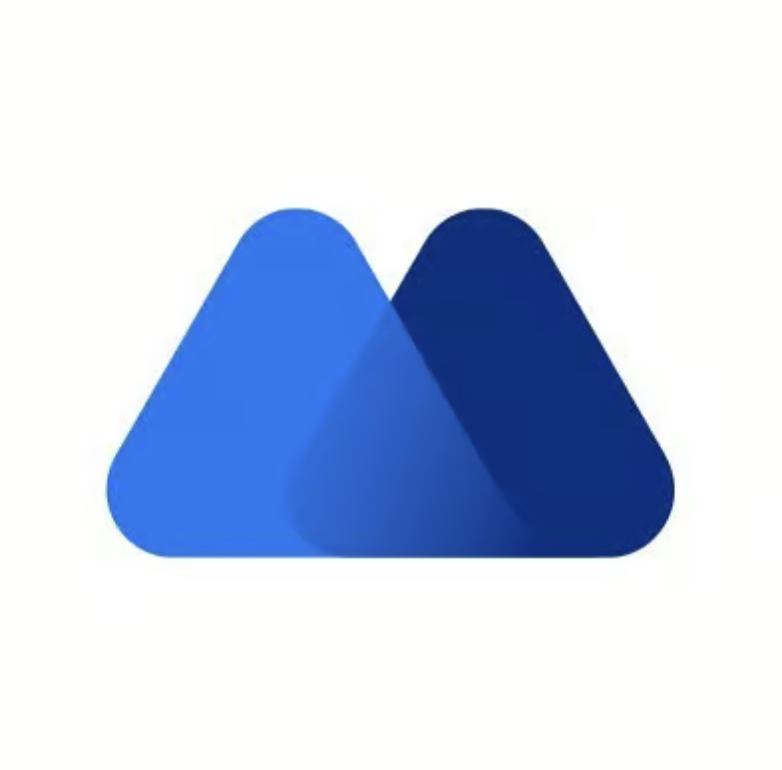

  <b>🔥 全网最全加密货币资源库,币圈导航站：<a href="https://www.0xnav.com" target="_blank">www.0xnav.com</a> 🔥</b>

&nbsp;

# 前言
- **虚拟加密货币资源大全，欢迎访问全网最全的区块链与加密货币资源导航平台，专为币圈新手与爱好者打造，提供一站式信息整合服务，助您快速入门加密世界本站涵盖中心化交易所注册链接及官网入口，如欧易OKX、芝麻开门Gate、币安Binance等，囊括主流交易平台的注册引导与使用说明除此之外，还收录了实时数据分析工具、巨鲸资金流向追踪、NFT市场行情动态、优质空投信息、链上分析平台、DeFi协议解析、DAO社区运作、跨链桥接工具、安全加密钱包推荐等各类高频使用资源我们致力于为用户提供最新最全的币圈实用工具和学习资料，降低信息获取门槛欢迎社区成员积极反馈补充，共建开放共享的区块链知识库关注本站，开启您的加密资产投资之路，深入探索Web3的无限可能** 

# **导航：** 

[科学上网工具](#科学上网工具) | [交易所](#交易所) | [空投](#空投)

## 科学上网工具

- [vpnnav.github.io](https://vpnnav.github.io)

请注意，以上工具仅供学习使用若利用这些工具从事违法犯罪行为，我们概不承担任何法律责任

## 交易所
| [ 币安](https://accounts.binance.com/zh-CN/register?ref=896983517) | [ 欧意OKX](https://www.chouyi.pro/zh-hans/join/50253981) | [ ByBit](https://www.bybit.com/invite?ref=4VLKDMW) | [ 火币](https://www.htx.com.de/zh-cn/v/register/double-invite/?invite_code=xpi6a223&inviter_id=11346560) | [ bitget](https://www.bitget.com/zh-CN/) |
|:---:|:---:|:---:|:---:|:---:|
| [ CoinBase](https://www.coinbase.com/) | [ kraken海妖](https://www.kraken.com/) | [ KuCoin](https://www.kucoin.com) | [ 抹茶MEXC](https://promote.mexc.com/r/wIE7fPvG) | [ Gate.io](https://www.gatesee.com/signup/VLDFUFEOAW?ref_type=103) |

**❗❗️️❗一旦注册完成就不再会有永久减免的机会，注册时务必使用邀请码❗️❗️❗️**

| 名字     | 链接 | 功能描述     |
| :---        |    :----:   |          :--- |
| 币安    |   [https://www.binance.com](https://accounts.binance.com/zh-CN/register?ref=896983517)   | 邀请码：**zhuanmi**，币安交易所(持有bnb减免40%手续费)币安最近Alpha刷积分活动，空投每个月基本都可以领上万块，感兴趣可以看看[币安刷Alpha积分视频教程](https://www.youtube.com/results?search_query=%E5%B8%81%E5%AE%89alpha)|
| 欧易OKX    |   [https://www.okx.com](https://www.chouyi.pro/zh-hans/join/50253981)   |      欧易交易所(减免30%手续费)|
| ByBit    |   [https://www.bybit.com](https://www.bybit.com/invite?ref=4VLKDMW)   |      ByBit交易所(减免30%手续费)|
| Bitget    |   [https://www.bitget.com](https://www.bitget.org/zh-CN/referral/register?clacCode=QR4A7MPY&from=%2Fzh-CN%2Fevents%2Freferral-all-program&source=events&utmSource=PremierInviter)   |      Bitget交易所(减免40%手续费)|
| Gate.io    |   [https://www.gatesee.com](https://www.gatesee.com/signup/VLDFUFEOAW?ref_type=103)   |     Gate.io交易所(减免40%手续费)|
| 火币    |   [https://www.htx.com](https://www.htx.com.de/zh-cn/v/register/double-invite/?invite_code=xpi6a223&inviter_id=11346560)   |      火币交易所(减免30%手续费)|
| 抹茶    |   [https://www.mexc.co](https://promote.mexc.com/r/wIE7fPvG)   |      抹茶交易所(减免40%手续费)|

## 空投

### 币安Alpha查询网站
- [AlphaHub](https://bnalphahub.com/) - 免费多钱包币安alpha交易积分查询工具
- [币安Alpha空投日历](https://alpha123.uk/zh/index.html) - 实时监控币安Alpha项目空投
- [胖大星-空投查询](https://pangdaxing.xyz/) - 实时监控币安Alpha项目空投
- [Alpha Bot](https://new.alphabot.cm/) - Alpha交易量钱包查询
- [Alpha.DOG](https://alpha.dog/) - Alpha交易量钱包查询
- [BSC USDT 统计分析工具](https://sincitysh.github.io/bscalpha/usdt-analyzer.html) - BSC USDT 统计分析工具

### 币安Alpha

币安 Alpha 积分是一个积分系统，用于评估用户在币安 Alpha 和币安钱包生态内的活跃度，从而确定其参与代币生成活动 (TGE) 和 Alpha 代币空投等的资格。

积分决定用户是否能参与TGE或领取Alpha代币空投，自2025年5月13日起，参与活动会扣除积分。 积分每天更新，基于过去15天的资产余额（币安无私钥地址钱包）和购买 Alpha 代币交易量计算。请注意，现阶段出售币安 Alpha 代币不会获得币安 Alpha 积分。币安Alpha积分是过去15 天内每日积分(余额积分加上成交量积分)的累计总和。

结论：积分=录取分数线＝空投，是资产+交易量双维度计算

积分由资产余额积分和交易量积分两部分组成。每日会在 UTC 时间 23:59:59 快照用户在币安CEX主账户和无私钥钱包的资产余额，以及过去24小时内购买Alpha代币的金额，计算当日积分。积分采用滚动15天计算机制，每笔积分15天后过期。具体规则如下：

余额积分： 统计总资产余额，按阶梯给予积分。例如余额 $100-$1,000 每日 1 分，$1,000-$10,000 每日 2 分，$10,000-$100,000 每日 3 分，≥$100,000 每日 4 分。单日最高余额积分为 4 分（对应持仓 ≥ $100,000）。

| 资产范围             | 每日积分 |
|----------------------|----------|
| $100–$1,000          | 1        |
| $1,000–$10,000       | 2        |
| $10,000–$100,000     | 3        |
| $100,000 及以上      | 4        |

交易量积分：仅统计当日Alpha代币的买入交易计入积分，卖出不计入。积分按买入金额翻倍递增，买入 $2 记 1 分，$4 记 2 分，$8 记 3 分，$16 记 4 分，$32 记 5 分，以后每翻倍金额多 1 分。例如买入 $600 后又卖出 $500，仍按 $600 计算积分。

| 买入金额 ($) | 积分 |
|--------------|------|
| 2            | 1    |
| 4            | 2    |
| 8            | 3    |
| 16           | 4    |
| 32           | 5    |
| 64           | 6    |
| 128          | 7    |
| 256          | 8    |
| 512          | 9    |
| 1024         | 10   |
| 2048         | 11   |
| 4096         | 12   |
| 8192         | 13   |
| 16384        | 14   |
| 32768        | 15   |
| 65536        | 16   |
| 131072       | 17   |
| 262144       | 18   |
| 524288       | 19   |
| 1048576      | 20   |

活动介绍：https://www.0xnav.com/260.html

